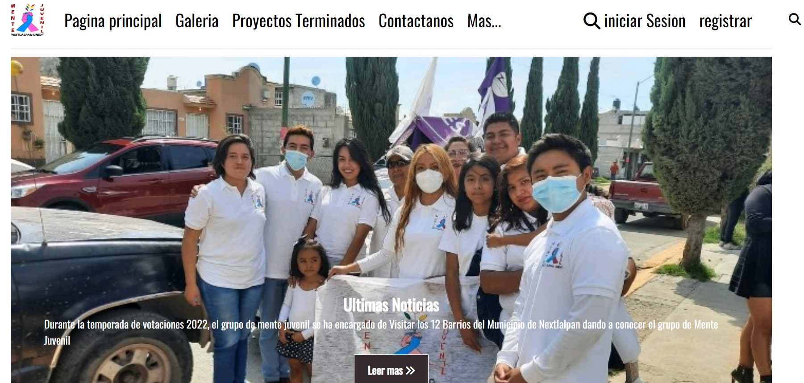
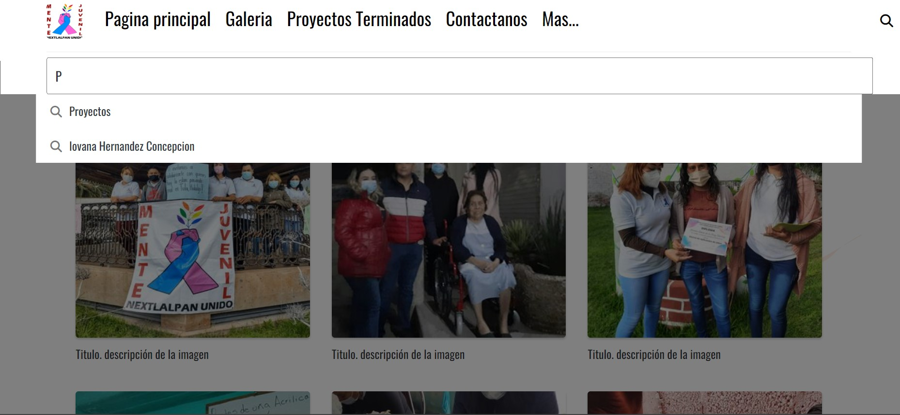

# PaginaWebMenteJuvenil
Pagina web de Mente Juvenil
## Contenido
- [Descripcion](#descripcion)
- [Carcateristicas](#caracteristicas)
- [Capturas de pantalla](#capturasDePantalla)

## Descrpcion 

- una pagina de Creada para una asociacion de Jovenes en busca de la mejora de la calidad de vida del municipio de Nextlalpan 

## Caracteristicas 
- Uso de herramientas HTML CSS JavaScript
- paginas: Galeria, Contactanos, Proyectos
- buscador: (uso de JS)

## Capturas de pantalla 
Portada de Pagina Web en desarrollo

Galeria de Imagenes

Buscador
